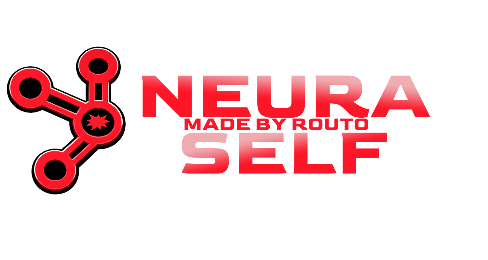
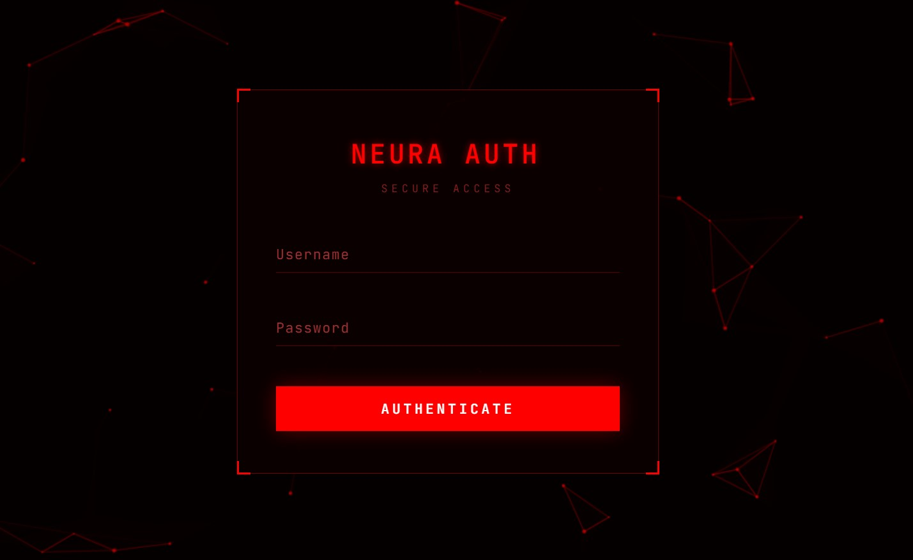
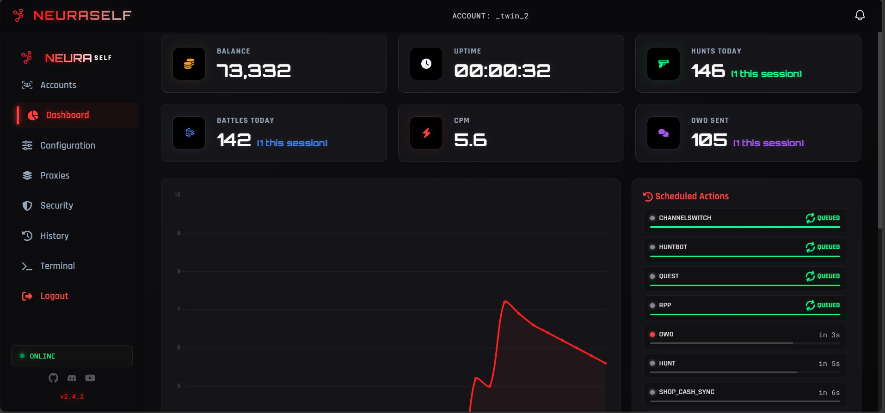
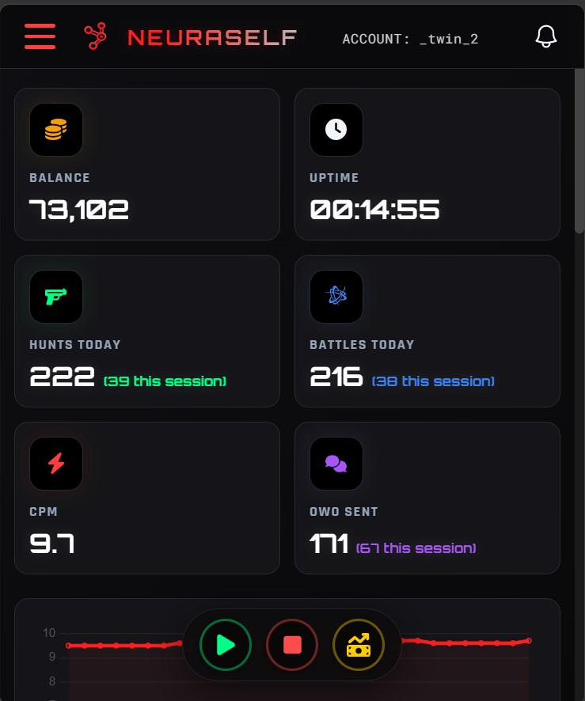

> Development copy: see [setup, changes, tests and limitations](TESTING_AND_SETUP.md).

<div align="center">
  
  
  <br/>
  <br/>

  
  
  <br/>
  <br/>

  
  
  
  
  
  <br/>
  <br/>

</div>

---

> [!IMPORTANT]
> WE ARE NOT responsible if you get banned using our selfbots. Selfbots are against Discord ToS and break OwO bot rules. Use only in private servers and do not openly share that you are using automation.

## What is Lazy Farmers?

**Lazy Farmers** is a powerful, fully-featured OWO-BOT automation tool offering a premium web dashboard. It allows you to monitor all your data in real-time through an easy-to-manage, beautifully designed interface.

---

## Features

- **Full Web Dashboard**:
 Real-time stats, charts, and a live configuration editor via an elegant interface.Easy to manage

- **Mobile Support (Termux)**: Fully functional on Android devices with toast notifications and vibrations.

- **Smart Captcha Solvers**:
 4captcha services to solve hcaptcha , onnx model to solve letterword captcha and fallback to manual solve

- **Multi-Account Manager**:
 Safely run unlimited accounts simultaneously with independent settings.

- **Advanced Stealth & Security**: Realistic typing simulation, auto-pause on detection, and multi-layer security to keep you safe.

- **Advanced Gambling**:
Instead of sending just gambling commands, it has strategies (martingale ,flat) also has stoploss and take profit!!

- **Dynamic Quest Intelligence**: Automatically completes checklists and tracks progression.

- **Advanced AutoGems**: Automatically equip gems.

- **Owner Commands**: From your own account, type `farmers pay` and every farm account prays for you, `farmers send` and they each transfer their cowoncy to you, `farmers showbal` and they post their balance. Anything else is forwarded straight to OwO, so `farmers team add bee2` makes every account run `owo team add bee2`, `farmers zoo` runs `owo zoo`, and so on. Enable it under the `owner` section in the config (set `user_id` to your Discord ID; `trigger` renames the `farmers` keyword).

- **Easy to setup** : Setup files make it very easy to download and configure.

- **Many more features........................**


---

## Installation

### Windows

```bash
curl -o "%TEMP%\install_lazyfarmers.bat" https://raw.githubusercontent.com/Aditimybbby/Jj/main/install_lazyfarmers.bat && "%TEMP%\install_lazyfarmers.bat"
```

### Termux / Linux / MacOS

```bash
bash <(curl -s https://raw.githubusercontent.com/Aditimybbby/Jj/main/install_lazyfarmers.sh)
```

#### For Termux

Make sure to install the **Termux** and **Termux:API** apps from F-Droid or GitHub (grant the API app notifications permission). After the installation script finishes, follow the setup steps prompted by `neura_setup.py`. If you face issues with the basic installation, try the manual installation method.

---

## Dashboard

Once the bot is running, you can access the beautiful dashboard at:

**<http://localhost:8000>**

The Accounts page does everything the terminal menu does — add accounts (name, token, channel IDs),
bulk import tokens, verify them, and start or stop each account while the process keeps running. Handy
when there is no terminal at all, e.g. hosted deployments (see [RAILWAY.md](./RAILWAY.md)).

---

## Disclaimer

This tool is for **educational purposes only**. Using self-bots violates Discord's Terms of Service.

<div align="center">

### Lazy Farmers

**Advanced OwO Bot Grinder** • Multi-user dashboard • Made with ❤️

**Star this project if you find it useful!**

</div>

## Screenshots

### Login Page Screenshot


### Dashboard


### Dashboard Mobile

